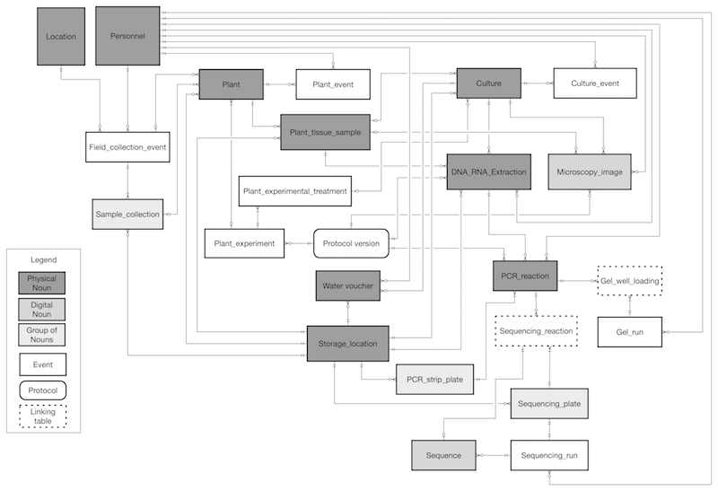

databases
========================================================
author: 
autosize: true
font-family: 'Arial'

Terminology
========================================================

* A database (DB) is an organized collection of data
* A database management system (DBMS) is a software that allows interacting with the database (e.g., storing, retrieving, updating data)
* Many types/flavors of databases: document, key-value

Attribution: Introduction to Data Science: BIO 260 and CSCI E107, Harvard T.H. Chan School of Public Health

Relational database
========================================================
* Relational model (RM):
  + built atop a set-theory branch called relational algebra: a combination of selections ( WHERE ... ), projections ( SELECT ... ), Cartesian products ( JOIN ... ), and more
* RDBMS = DBMS + RM
* SQL (Structured Query Language) is a language designed to interact with RDBMS
* IBM in the 1970s (Edgar Codd)

Attribution: Introduction to Data Science: BIO 260 and CSCI E107, Harvard T.H. Chan School of Public Health

Why use a RDBMS?
========================================================

* Data size, typically when the data fits on drive but not in memory
* Harness the power of SQL
* One DB vs (too) many CSV files - **complexity!**
* Data already live in a DB
* DB provides extra tools, for example a GIS toolbox to deal with spatial data

attribution: introduction to data science: bio 260 and csci e107, harvard t.h. chan school of public health

RDBMS software solutions
========================================================

* Commercial
  + Oracle
  + Microsoft SQL Server
  + ...
* Open-source
  + MySQL
  + PostgreSQL
  + SQLite
  + ...
  

attribution: introduction to data science: bio 260 and csci e107, harvard t.h. chan school of public health

  
SQLite
========================================================
  
* SQLite is the easiest way to start: unlike others, it is not a client-server DB. The whole DB can live in a (portable) folder. All the required tools are included in dplyr.
* Light but still powerful. It barely requires configuration but can still store and process large amounts of data. It is used in most web browsers and mail clients.

attribution: introduction to data science: bio 260 and csci e107, harvard t.h. chan school of public health

Structure
========================================================
title: false

table structure

***
database structure (schema)

